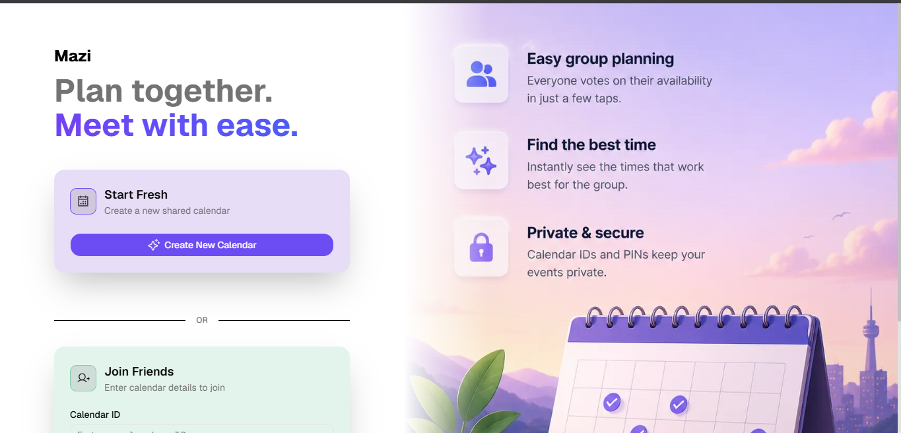
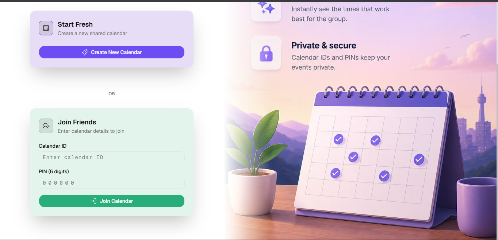
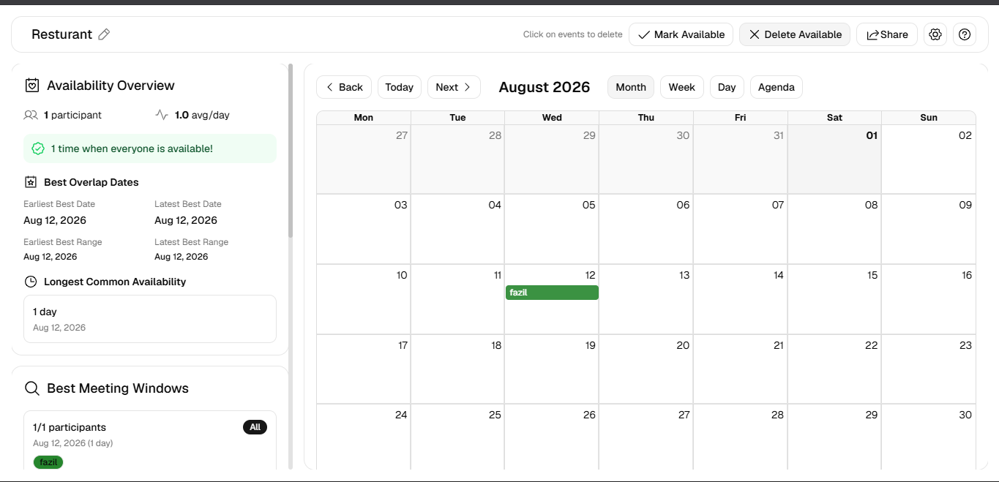
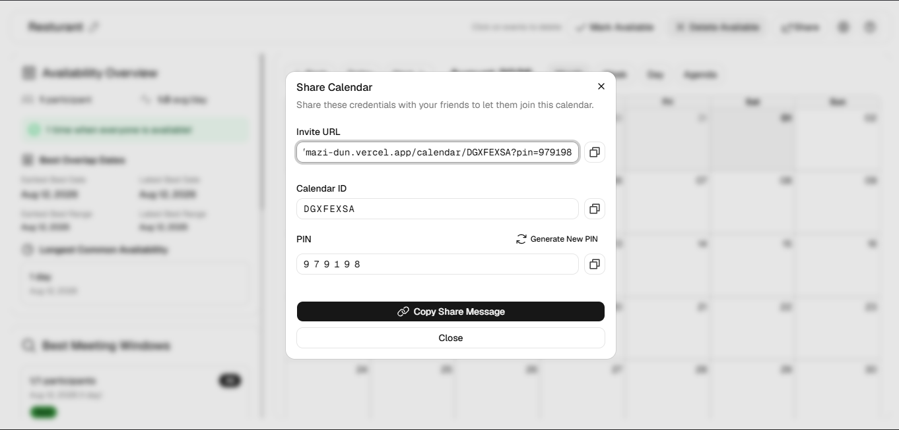

# MAZI 🗓️

> **MAZI** (Μαζί) is a Greek word meaning **"together."**

MAZI is a collaborative scheduling platform that helps friends, teammates, and groups quickly find a time to meet. Instead of creating accounts or managing invitations, users can simply create a shared calendar and invite others using a **Calendar ID** and **PIN**.

Everyone joins the same shared calendar, marks their availability, and instantly sees when everyone's schedules overlap, making it easy to plan meetings without the usual back-and-forth messaging.

---

## ✨ Features

- 📅 Create shared calendars instantly
- 🔑 Join using a **Calendar ID** and **PIN** — no sign-up required
- 👥 Collaborate in real time with friends or teammates
- ✅ Mark your available time slots
- ❌ Remove availability with a single click
- 📊 Availability insights and meeting analytics
- 🤝 Find overlapping free time across participants
- 📱 Responsive design for desktop and mobile
- ⚡ Fast, modern, and lightweight experience

---

## 🚀 How It Works

1. Create a new calendar.
2. Share the generated **Calendar ID** and **PIN** with others.
3. Participants join the shared calendar using the credentials.
4. Everyone marks their available time slots.
5. MAZI highlights overlapping availability, helping the group quickly decide the best meeting time.

---

## 🛠 Tech Stack

### Frontend

- Next.js 16
- React 19
- TypeScript
- Tailwind CSS v4
- Base UI
- React Big Calendar
- Zustand

### Backend

- Next.js Route Handlers
- Prisma ORM
- PostgreSQL
- Supabase

### Deployment

- Vercel

---

## 📦 Installation

```bash
git clone https://github.com/MohamedFazil1406/MAZI.git

cd MAZI

pnpm install

pnpm prisma generate

pnpm dev
```

Visit:

```
https://mazi-dun.vercel.app/
```

---

## 🔐 Environment Variables

Create a `.env` file:

```env
DATABASE_URL=
DIRECT_URL=

NEXT_PUBLIC_SUPABASE_URL=
NEXT_PUBLIC_SUPABASE_PUBLISHABLE_KEY=

```

---

## 📸 Screenshots

<table>
<tr>
<td width="50%">

### Home Page



</td>

<td width="50%">

### Join Calendar



</td>
</tr>

<tr>
<td width="50%">

### Collaborative Calendar



</td>

<td width="50%">

### Share Calendar



</td>
</tr>
</table>

---

## 🤝 Contributing

Contributions are welcome!

1. Fork the repository
2. Create a new branch

```bash
git checkout -b feature/my-feature
```

3. Commit your changes

```bash
git commit -m "feat: add new feature"
```

4. Push your branch

```bash
git push origin feature/my-feature
```

5. Open a Pull Request

---

## 👨‍💻 Author

**Mohamed Fazil**

- GitHub: https://github.com/MohamedFazil1406
- LinkedIn: https://www.linkedin.com/in/mohamedfazil1406
- Website: https://www.fazil-coding.me
